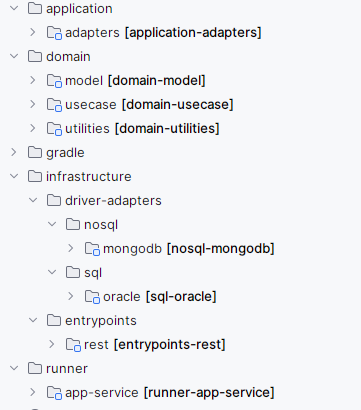

# Scaffold GamboaTech - Spring Boot


***
<div id='id1' />

## 1. Sobre la Arquitectura
 
Arquitectura base utilizada para la creación de microservicios utilizando el framework de desarrollo Spring Boot.

> **Nota:** Si quieres saber más de Spring Boot visita su sitio oficial: https://spring.io/projects/spring-boot.

El objetivo de este proyecto es usarlo como base para el desarrollo de aplicaciones, una vez clonado,
debes incluir tus propias clases en los módulos pre-configurados del proyecto.

La distribución de módulos y paquetes del proyecto se basa en Arquitecturas Limpias. El proyecto tiene la siguiente distribución de directorios:



<div id='id2' />

## 2. Pre-Requisitos
* Tener instalado [**Java 17**](https://www.oracle.com/java/technologies/downloads/).
* Tener instalado [**Gradle 8.1.1**](https://gradle.org/install/).
* Tener instalado [**Podman**](https://podman.io/docs/installation). Si usas Windows y tienes problemas con la
  ejecución de Podman, puedes ver esta [guía](https://blog.scottlogic.com/2022/02/15/replacing-docker-desktop-with-podman.html).
* Se requiere un servidor **Oracle** instalado en la máquina local, para esto se recomienda usar una imagen de
  docker, la cual puedes obtener ejecutando el siguiente comando:
  ```shell script
  podman run -d --name oracle -p 1521:1521 -e ORACLE_DATABASE=devlocal -e APP_USER=develop -e APP_USER_PASSWORD=adminroot -e ORACLE_PASSWORD=adminroot gvenzl/oracle-free
  ```
  > **Nota:** Para conocer más sobre la imagen de oracle y su configuración, puedes  visitar su sitio oficial:
  > https://hub.docker.com/r/gvenzl/oracle-free


<div id='id2.3' />

## 3. Compilando la Aplicación

En el directorio raiz se debe ejecutar el siguiente comando:
```shell script
./gradlew bootJar
```

Esto genera el archivo `my-service.jar` en el directorio `/runner/app-service/build/libs`

<div id='id2.4' />
